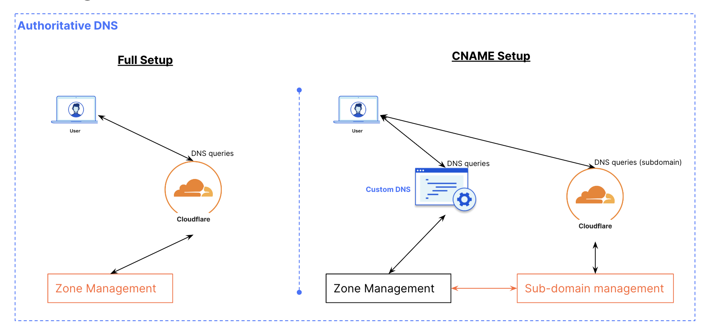

# Cloudflare DNS

Leverage Cloudflare’s global network to deliver excellent performance and reliability to your domain. 


## Prerequisites

*  Sign up for a Cloudflare Account : `https://dash.cloudflare.com/sign-up`
*  Buy a domain on your favorite registrar (GoDaddy, Route53, Google Domains, etc)


## 1. Main Features
Cloudflare DNS is an enterprise-grade authoritative DNS service that offers the fastest response time, unparalleled redundancy, and advanced security with built-in DDoS mitigation and DNSSEC.
* `Optimal Redundancy`: global Anycast network that allows DNS resolution at the network edge in each of their data centers across 310+ cities.
* `Security`:  built-in DDoS protection and one-click DNSSEC to ensure your applications are always safeguarded from DNS attacks.
* `Performance`: fastest DNS in the world, offering DNS lookup speed of 11ms on average and worldwide DNS propagation in less than five seconds.
* `Easy management`: user-friendly interfaces and access via API

## 2. Zone setups
### 2.1 Authoritative DNS
You can use Cloudflare as your primary DNS provider and manage your DNS records on Cloudflare


### 2.2 Secondary DNS
With incoming zone transfers, you can keep your primary DNS provider and use Cloudflare as a secondary DNS provider.


## 3. Getting started

### 3.1 Create a full setup zone
Go back to the previous folder, edit the `main.py` file with the following code:
```
import json
from modules.dns import DNS

ZONES = [("YOUR_DOMAIN", "full")]

dns = DNS()
dns.create_multiple_zones(account_id="YOUR_ACCOUNT_ID", zones=ZONES)

# Add an A record
dns.create_dns_record(type="A", content="76.76.21.21", name="YOUR_DOMAIN") 
```

Export your credentials and execute the script:
```
$ export CF_API_KEY="xxxxxxxxxxxxxxxxxxxxxxxxxxxx"
$ export CF_EMAIL="xxxxxx@cloudflare.com"

python3 main.py
```

A `zones_output.txt` file will be created containing the value of the nameservers assigned by Cloudflare to your domain. 
Copy the value of those name servers and update your `NS` records on your domain registrar.

Note that the domain propagation can take up to 24h.

### 3.2 Your domain information
```
# Verify that CF nameservers on your domain
$ dig NS +noadditional +noquestion +nocomments +nocmd +nostats YOUR_DOMAIN.

# Check that CF acts as reverse proxy 
# Normally you should CF ips. Your server's identity is hidden
$ dig A +noadditional +noquestion +nocomments +nocmd +nostats YOUR_DOMAIN.
```

### 3.3 Check DDoS mitigation
```
# Generate an instant high traffic on your domain and check the analytics from the dashbord
$ ab -n 10000  https://YOUR_DOMAIN
```